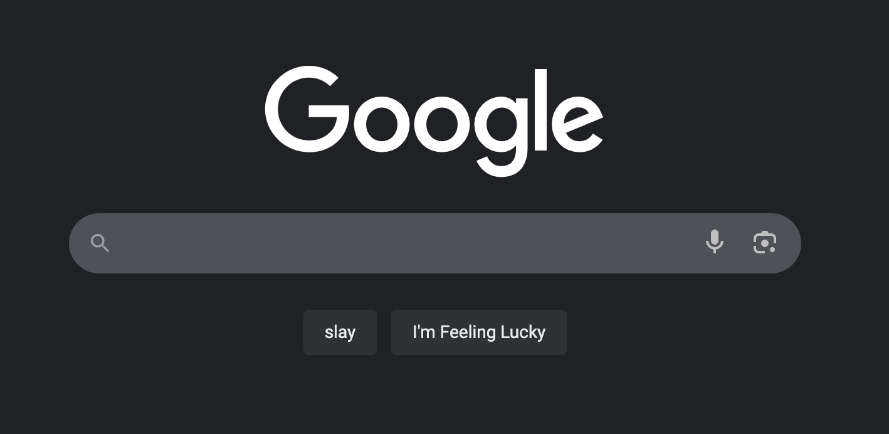
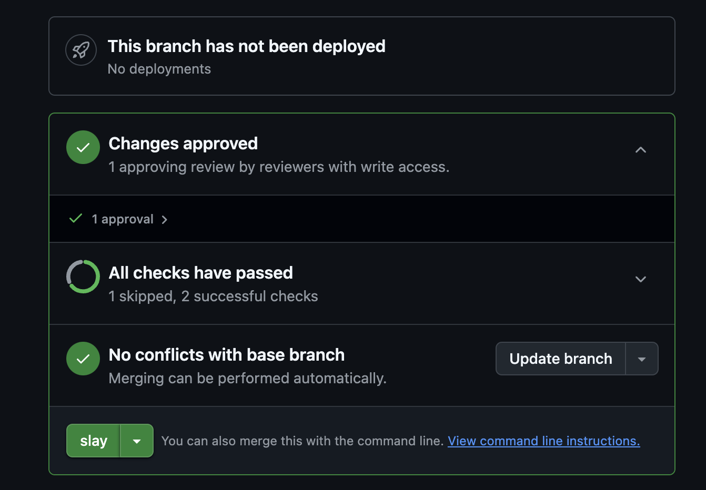

# slay button ✨
a chrome extension that modifies commonly buttons on websites to simply say "slay"

## install
available on the [chrome extension store](https://chromewebstore.google.com/detail/slay-button/djbaiejnfbbmohfocdodgooofmbkedci)

## add your own slay buttons
1. fork
2. add the domain with the button to [slay-config.js](./slay-config.js)
3. add either a string (used in `document.querySelectAll()`) or an anonymous function that returns an html element
3. raise a pr
4. fit check in pr (bonus points)

you can also open an issue if there's a button that you think would be fun to slay. just add the url and maybe a screenshot of the button and i can do it

## Examples

